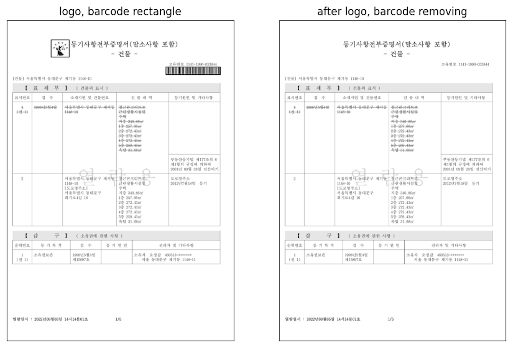
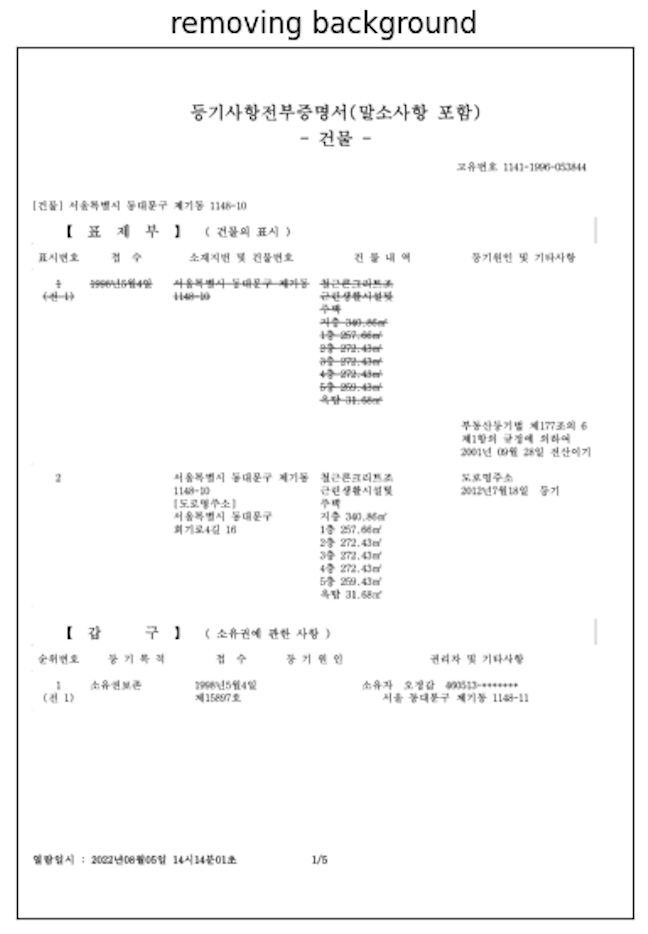
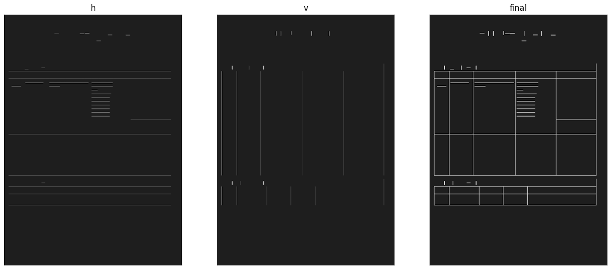

코드는 현재 미완성, 작동하지 않습니다.

# realEstateOCR
해당 리포지터리는 대한민국의 등기등본 문서에 적합한 OCR 기능을 목표로, Tesseract OCR의 pretrained된 모델의 등기부등본 형식을 Fine-tuning한 레포지토리이다. 표로 이루어진 문서 내용 구성과 한국 주소(한글, 숫자, 기호 등으로 구성)를 보다 정확하게 인식하는 것에 특장점을 지닌다.
표 추출을 위해 OpenCV 라이브러리와 OCR을 위한 Tesseract 프레임워크를 활용하였다. 그 후, 자연어 사전 유사도 매칭을 통한 OCR 성능을 보완하였다.

## Samples
<div display=flex flex-direction=row>



</div>

## Prerequisites
* python
* cv2
* numpy
* matplotlib.pyplot as plt
* imutils.perspective import four_point_transform
* from imutils.contours import sort_contours
* import imutils
* re
* requests
* from PIL import Image 
* pytesseract
* Tesseract
## Inference
1. input 폴더에 등기부등본 파일을 넣는다. (PDF와 PNG 및 JPEG/JPG파일 지원)
2. 본 레포지토리의 루트에서 다음 코드를 실행시키면 된다.
````
python tools/infer.py [OPTIONS]
````
## Options
##### --save Y|N
추출된 내용을 csv 파일로 저장한다.
````
Y : save as csv
N : default
````
##### --e Y|N
문서 내 말소사항은 제외하고 출력한다.
````
Y : 말소사항 제외
N : default, 말소사항 포함
````

## Train
* 해당 레포지토리는 Tesseract OCR을 활용하여, 이하, 학습을 위해서는 Tesseract OCR의 tesstrain을 사용한다.
https://github.com/tesseract-ocr/tesstrain

## How it works
본 레포지토리 내 main.ipynb 파일에서 해당 소프트웨어의 OCR 전처리 및 작동 과정을 시각적으로 확인이 가능하다.
* OCR 전처리 과정
1. 회전도 측정
2. 선명도 증가
3. 로고 및 바코드 영역 템플릿 매칭 및 제거
4. 문서 내 표 인식 및 제거
5. 이진화 및 워터마크 제거

* OCR 실행

* OCR 후처리 - 자연어 사전 유사도 매칭을 통한 OCR 개선

## About OCR

<br>
<br>
<br>
<br>


---

## 전세 사기 예방을 위한 블록체인 기반 OCR 활용 부동산 계약 시스템

### 📌 개요
본 개발은 **블록체인**과 **OCR 기술**을 활용한 **부동산 계약 자동화 시스템 구축**을 목표로 한다. 

**등기부등본 및 건축물대장 정보**를 AI 기반 OCR로 분석하여 **계약서 자동 생성 및 확정일자 부여 기능**을 제공하며, **분산 신원 확인(DID)과 스마트 컨트랙트**를 적용하여 신뢰성을 강화한다. 

또한, **KB 부동산 시세 크롤링 및 마이데이터 API 연동**을 통해 **변동 사항을 자동 감지**하고, **전세 사기 위험 분석**을 기반으로 **특약 조항을 자동 추가**하는 기능을 구현한다. 

이를 통해 **중개 비용 절감, 계약 투명성 확보, 부동산 시장 안정화 및 보증 기관의 재무 건전성 개선**을 기대할 수 있다.


### 📍 서비스 설명


### 📍 시연 영상
https://github.com/user-attachments/assets/dd0f915d-45e8-4dda-9c62-665d2ca64200


